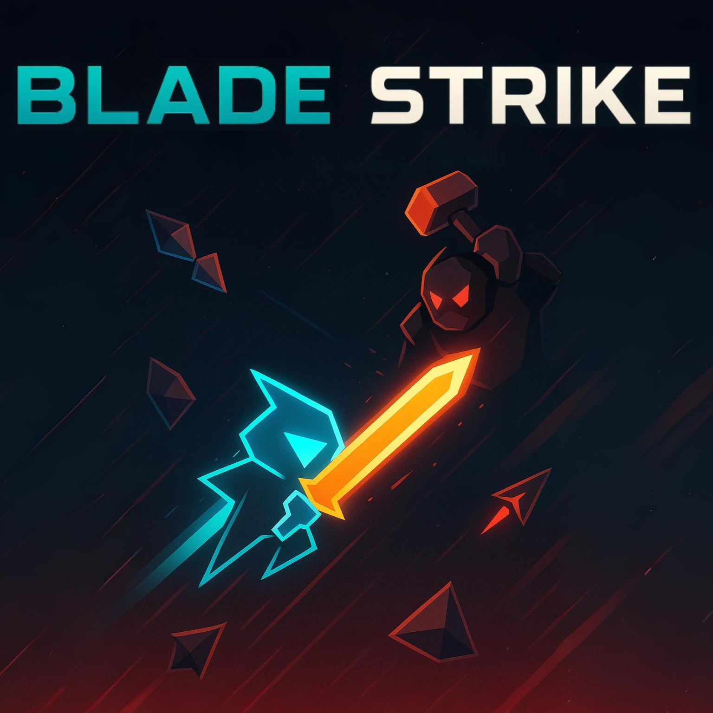

# Blade

A fast-paced top-down action combat game where you face waves of enemies and epic boss battles. Master the art of sword combat, dodge enemy attacks, and upgrade your abilities to become the ultimate warrior.

## Controls
- **WASD**: Movement
- **Left Click**: Attack
- **Space**: Dash
- **F**: Toggle Fullscreen

## Loads of AI support
A prime goal of this project was to familiarize myself with the limits of today's AI tools.  As such I used AI wherever possible, and probably wrote less than 5% of the code myself.  I also used Suno AI to generate the music.  This process sped up development significantly, and the whole game was made in about 2 days. 

## Features

### Combat System
- **Dynamic Combat**: Fast-paced melee combat with precise hitboxes and timing
- **Dash Ability**: Quick dodge maneuvers with upgradeable cooldown
- **Advanced Melee System**: A system that allows for a wide variety of melee weapons with unique mechanics
- **Combat Feedback**: Visual effects, particles and sound effects for impactful combat

### Enemy Types
- **Basic Enemies**: Standard sword-wielding foes
- **Tank Enemies**: Heavy hitters with powerful hammer attacks
- **Ranged Enemies**: Bow-wielding attackers that maintain distance
- **Spear Enemies**: Long-range melee attackers
- **Fast Enemies**: Quick, agile opponents with daggers
- **Flanker Enemies**: Tactical enemies that dodge your attacks and try to flank you
- **Boomerang Enemies**: Unique attackers with curving projectiles

### Boss Battles
- **The Warrior**: A powerful tank boss with devastating hammer strikes
- **The Berserker**: An aggressive boss that becomes more dangerous at low health
- **The Hunter**: A tactical ranged boss with multi-arrow attacks

### Progression System
- **Wave-Based Combat**: Face increasingly difficult waves of enemies
- **Upgrade System**: Choose from various upgrades after clearing boss waves:
  - Movement Speed
  - Dash Cooldown Reduction
  - Weapon Range

## Controls

- **WASD**: Movement
- **Mouse**: Aim
- **Left Click**: Attack
- **Space**: Dash
- **F**: Toggle Fullscreen

### Controller Support

- **Left Stick**: Movement
- **Right Stick**: Aim
- **Right Trigger**: Attack
- **Left Trigger**: Dash

## Technologies Used
- **TypeScript**: For type-safe code and improved cursor AI support
- **PixiJS**: 2D WebGL rendering
- **Custom Physics**: Built-in collision detection and response
- **Custom Sound System**: Optimized audio management using zzfx
- **Suno AI**: Music created by Suno AI's v4 diffusion model

## Performance
- Runs at 60 FPS on modern browsers
- Optimized particle systems and visual effects
- Efficient entity management and collision detection

## Browser Support
- Chrome (recommended)
- Firefox
- Safari
- Edge

## Contributing
1. Fork the repository
2. Create a feature branch
3. Submit a pull request

## License
MIT License - See LICENSE file for details

## Credits
- Game Design & Development: [Your Name]
- Sound Effects: Custom synthesized audio
- Art & Visual Design: Procedurally generated graphics
